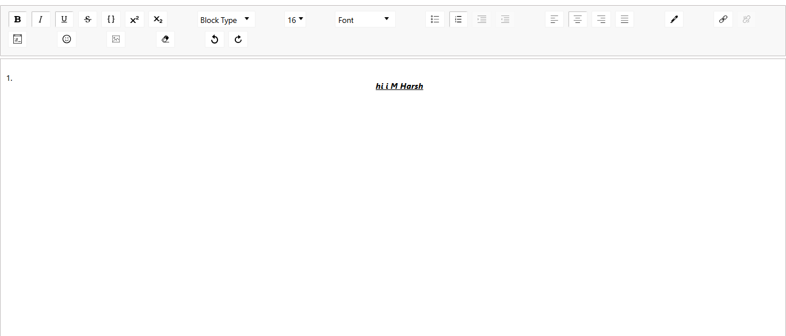

# Rich Text Editor (React + Draft.js)

A fully customizable **Rich Text Editor** built using **React** and **Draft.js**, without relying on third-party wrappers like `react-draft-wysiwyg`. Supports:

- Bold, Italic, Underline, Strikethrough, Superscript, Subscript  
- Font size & font family selection  
- Lists (ordered & unordered)  
- Text alignment (left, center, right, justify)  
- Color picker for text  
- Links & Images  
- Undo/Redo  
- Adding link 

---

## styling library link

https://cdn.jsdelivr.net/npm/react-draft-wysiwyg/dist/react-draft-wysiwyg.css

## Demo



---

## Installation

1. Clone the repository:

```bash
git clone https://github.com/yourusername/rich-text-editor.git
cd rich-text-editor
npm  install 
npm start